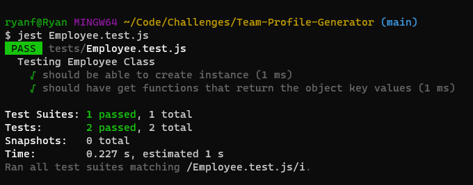

# Team-Profile-Generator

## Description

The motivation to create this project was to further explore the 'inquirer' and 'jest' node modules. Inquirer allows a developer to prompt a user for data, while Jest is used to run developed test scripts to ensure the tested code runs as intended. Using node js and these modules, I developed a CLI application for building a user's team roster so that they can quickly access their team's emails and GitHub profiles. The application prompts the user to enter information about each member of their roster, and once finished, will generate an HTML presenting all of the user given information. 

By completing this project, I learned how to better use JavaScript Classes and Subclasses, along with testing those classes with Jest. I also learned how to chain promises to ensure that Inquirer runs correctly in order to obtain user data. 

## Table of Contents

- [Installation](#installation)
- [Usage](#usage)
- [License](#license)
- [Contributing](contributing)
- [Tests](#tests)
- [Questions](#questions)

## Installation

This project uses the 'inquirer 8.2.4' and 'jest 29.3.1' node modules. To install the modules run 'npm i' in the project directory.

## Usage

To run this application, navigate to the root project directory and run the command 'node index.js'. Once started, the user will be prompted to answer a series of questions about each team member.

After all of the questions are answered, the user will be presented with a menu for adding another team member. The user can select to add another member by choosing 'Engineer' or 'Intern', otherwise, 'I am finished' will end inquirer and generate the HTML file.

After selecting 'I am finished' the user is presented with a confirmation message and the HTML file for the team roster is written to './dist/index.HTML'. The screenshot below shows an example with team members Ryan and Fred.

The generated webpage presents the user with cards containing the information for all of their team members. The listed email addresses are linked to open the user's default email program and will populate the TO field of the email with the given address. For team members that are Engineers, their listed usernames are links to their respective GitHub profile.

## License

N/A

## Contributing

N/A

## Tests

Tests for this project are run using the jest module and are located in the 'tests' folder. Each unit test in 'tests' tests the functionality of the class constructors and methods scripts in the 'lib' folder. To run a specific test use the command 'jest {filename.test.js}' or use 'jest tests' to run all four unit tests. The images below shows an example runs of these commands.

## Questions

A video demonstration for this project can be found [here](https://drive.google.com/file/d/1vIeOxetCiYtLRkbhKjnugnHR0X5e9X-2/view).

If you have any questions about the repo, open an issue or contact me directly at ryanfernandez11@gmail.com. You can find more of my work at [my GitHub page](https://github.com/ryanafernandez/).